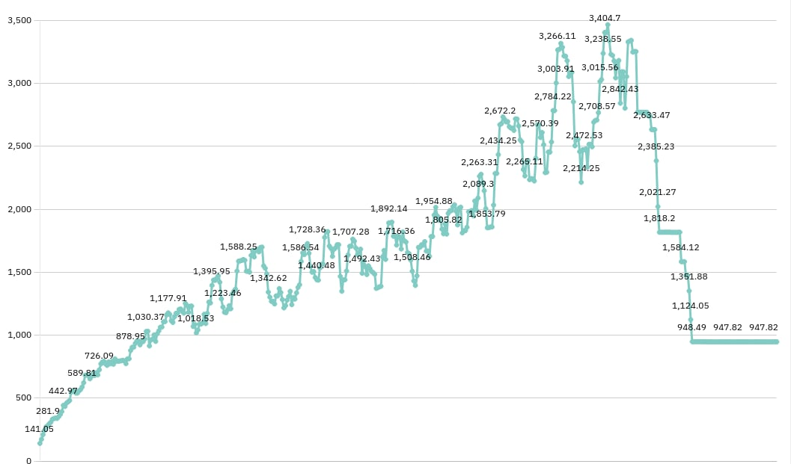

# QD VectorDB

A high-performance TypeScript Vector Database with LSM storage and KD-tree indexing, supporting cosine similarity and euclidean distance searches.

[](https://badge.fury.io/js/qd-vectordb)
[](https://opensource.org/licenses/MIT)

## RAM Usage Logging



## Features

- **High Performance**: LSM-tree storage design for fast writes and efficient reads
- **KD-Tree Indexing**: Accelerated k-NN queries for moderate dimensions
- **Similarity Search**: Both cosine similarity and euclidean distance support
- **Concurrency**: Thread-safe operations with async RWLock coordination
- **Persistence**: WAL + SSTables for durable storage
- **Batch Operations**: Efficient bulk insert and delete operations
- **TypeScript**: Full type safety with comprehensive type definitions

## Installation

```bash
npm install qd-vectordb
```

## Quick Start

```typescript
import { VectorDB } from 'qd-vectordb';

async function example() {
  // Open database
  const db = await VectorDB.open({ 
    dir: './data',
    memtableFlushSize: 100,
    maxSSTablesBeforeCompact: 8
  });

  // Add single vector
  const id = await db.add([0.1, 0.2, 0.3], { label: 'example' });

  // Add multiple vectors in batch
  const ids = await db.addBatch([
    { vector: [1, 0], meta: { category: 'A' } },
    { vector: [0, 1], meta: { category: 'B' } },
  ]);

  // Search by cosine similarity
  const similar = await db.searchSimilar([0.9, 0.1], 5);
  console.log('Similar vectors:', similar);

  // Search by euclidean distance
  const nearby = await db.searchNearby([0.9, 0.1], 5);
  console.log('Nearby vectors:', nearby);

  // Delete operations
  await db.delete(id);
  await db.deleteBatch(ids.slice(0, 2));

  // Get count
  const count = await db.count();
  console.log('Total vectors:', count);

  // Persist and close
  await db.save();
  await db.close();
}

example().catch(console.error);
```

## API Reference

### VectorDB.open(options)

Creates and opens a new VectorDB instance.

**Parameters:**
- `options.dir` (string): Directory path for data storage
- `options.memtableFlushSize` (number, optional): Threshold for memtable flush (default: 1000)
- `options.maxSSTablesBeforeCompact` (number, optional): Max SSTables before compaction (default: 10)

**Returns:** `Promise<VectorDB>`

### Methods

#### `add(vector, metadata?, id?)`
Add a single vector to the database.

- `vector`: number[] - The vector to store
- `metadata`: Record<string, unknown> (optional) - Associated metadata
- `id`: string (optional) - Custom ID, auto-generated if not provided

**Returns:** `Promise<string>` - The vector ID

#### `addBatch(items)`
Add multiple vectors in a single batch operation.

- `items`: Array of `{ vector: number[], meta?: Record<string, unknown>, id?: string }`

**Returns:** `Promise<string[]>` - Array of vector IDs

#### `searchSimilar(query, k?)`
Search for vectors by cosine similarity.

- `query`: number[] - Query vector
- `k`: number (optional) - Number of results (default: 10)

**Returns:** `Promise<SearchResult[]>` - Results with similarity scores

#### `searchNearby(query, k?)`
Search for vectors by euclidean distance.

- `query`: number[] - Query vector  
- `k`: number (optional) - Number of results (default: 10)

**Returns:** `Promise<SearchResult[]>` - Results with distances

#### `delete(id)` / `deleteBatch(ids)`
Delete vector(s) by ID.

**Returns:** `Promise<boolean>` / `Promise<number>` - Success status or count deleted

#### `count()`
Get total number of vectors in the database.

**Returns:** `Promise<number>`

#### `save()`
Persist all changes to disk.

**Returns:** `Promise<void>`

#### `close()`
Close the database and release resources.

**Returns:** `Promise<void>`

## Types

```typescript
type Vector = number[];

type Metadata = Record<string, unknown>;

type SearchResult = {
  id: string;
  score?: number;      // For similarity search
  distance?: number;   // For nearby search
  vector: Vector;
  meta?: Metadata;
};

type OpenOptions = {
  dir: string;
  memtableFlushSize?: number;
  maxSSTablesBeforeCompact?: number;
};
```

## Architecture

- **Storage**: LSM-tree design with Write-Ahead Log (WAL) and Sorted String Tables (SSTables)
- **Indexing**: KD-Tree for efficient k-nearest neighbor queries
- **Concurrency**: Async RWLock ensures thread-safe operations
- **Persistence**: Configurable memtable flush and SSTable compaction

## Development

```bash
# Install dependencies
npm install

# Build the project
npm run build

# Run demo
npm run demo

# Clean build artifacts
npm run clean
```

## License

MIT License - see [LICENSE](LICENSE) file for details.

## Contributing

Contributions are welcome! Please feel free to submit a Pull Request.
